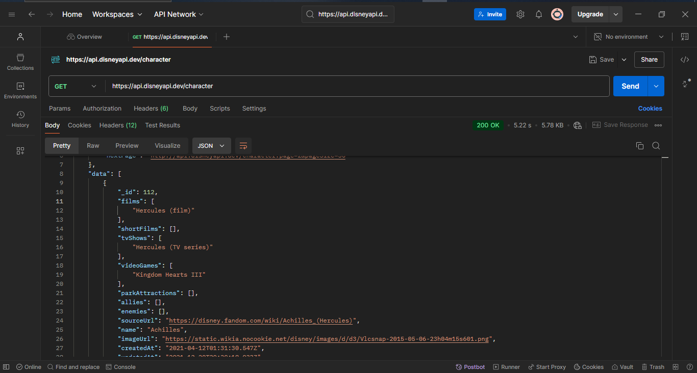
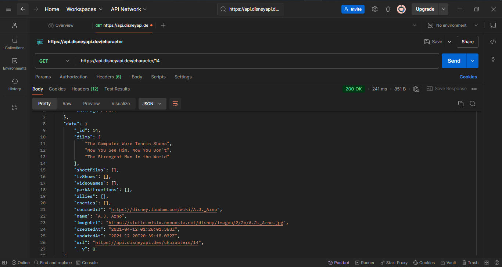
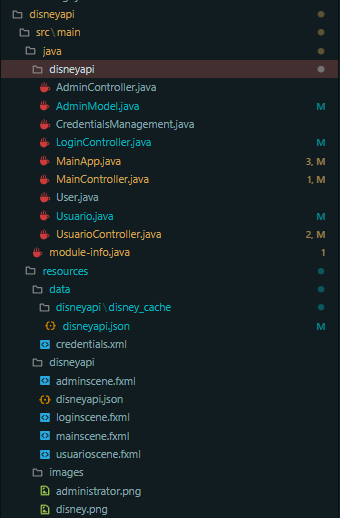
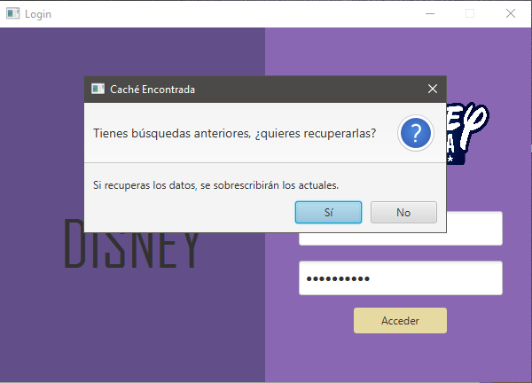
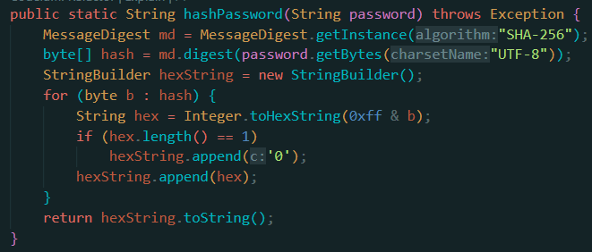
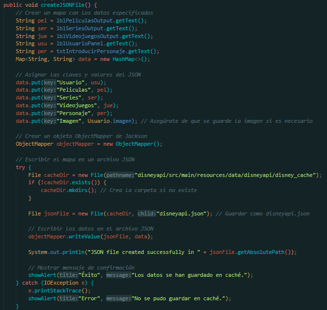
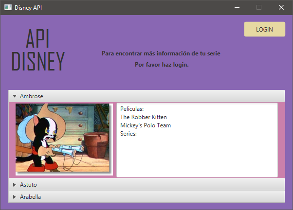

# ApiDisney

Este proyecto está desarrollado en Java y se conecta a la API de Disney.

**API utilizada:** [Disney API](https://api.disneyapi.dev/character)

---

### Hecho por:
**Luis Guillermo Andre Garrido** y **Diego Pérez Clavero**

---

## Descripción del Proyecto

ApiDisney es una aplicación diseñada para ofrecer información sobre las películas, series y juegos en los que aparecen diversos personajes de Disney, incluyendo imágenes de cada personaje. Para este proyecto, se implementó un algoritmo que realiza peticiones a una API externa, la cual proporciona archivos JSON con la información necesaria.

La aplicación utiliza **JavaFX**, permitiendo crear ventanas de alertas emergentes, asignar botones, y modificar tanto el tamaño como la estética de la interfaz.

### Ejemplos de JSON
A continuación se muestran ejemplos de las respuestas JSON que recibimos mediante Postman:

  
  

---

## Características del Proyecto

- **Inicio de sesión:** Permite a los usuarios registrados iniciar sesión.
- **Gestión de usuarios:** Los administradores pueden crear y eliminar usuarios.
- **Visualización de personajes:** Muestra tres personajes aleatorios si no hay sesión iniciada.
- **Búsquedas:** Permite realizar búsquedas de personajes al iniciar sesión.
- **Exportación de datos:** Posibilidad de exportar datos a diferentes formatos.

---

## Arquitectura del Proyecto

El proyecto sigue un modelo **MVC** (Modelo Vista Controlador):

  

---

## Clases Principales

### LoginController
Esta clase se encarga de gestionar el inicio de sesión tanto para administradores como para usuarios normales. Utiliza `CredentialsManagement.java` para verificar que las credenciales sean correctas.

  
  

### UsuarioController
Controla la interfaz de usuario normal, carga datos de personajes y realiza consultas al archivo JSON. También gestiona el almacenamiento en caché.

  
  

### MainController
Verifica la existencia de la base de datos. Si no existe, realiza una petición GET a la API y transforma la respuesta en JSON. Al iniciar `mainScene`, precarga aleatoriamente tres personajes con su información.

  

### AdminController
Utiliza
